# Expense Tracker API - Documentation

## Overview

This API is built using [**Node.js**](https://nodejs.org/en), [**Express.js**](https://expressjs.com), [**MongoDB**](https://www.mongodb.com), and [**Firebase**](https://firebase.google.com). It supports basic [**CRUD**](https://www.codecademy.com/article/what-is-crud) operations for managing expenses, authentication using [**JWT**](https://jwt.io), and image uploads to Firebase. The project follows a [**RESTful API**](https://aws.amazon.com/what-is/restful-api/) structure, with authentication and middleware for handling file uploads.

## Table of Contents

- [File Structure](#file-structure)
- [Detailed Explanation of Files](#detailed-explanation-of-files)
  - [Configuration Files](#configuration-files)
  - [Controllers](#controllers)
  - [Middleware](#middleware)
  - [Models](#models)
  - [Routes](#routes)
  - [Types](#types)
  - [App Entry Point](#app-entry-point)
- [API Endpoints](#api-endpoints)
- [Environment Variables](#environment-variables)
- [Running the Application](#running-the-application)

---

## File Structure

```plaintext
├── src
│   ├── app.ts                     # Application entry point
│   ├── config
│   │   ├── database.ts            # MongoDB connection configuration
│   │   └── firebase.ts            # Firebase storage configuration
│   ├── controllers
│   │   ├── authController.ts      # Authentication controller (register, login)
│   │   └── expenseController.ts   # Expense CRUD operations controller
│   ├── middleware
│   │   ├── auth.ts                # JWT authentication middleware
│   │   └── upload.ts              # Multer middleware for file uploads to Firebase
│   ├── models
│   │   ├── Expense.ts             # Expense Mongoose model
│   │   └── User.ts                # User Mongoose model
│   ├── routes
│   │   ├── authRoutes.ts          # Routes for authentication
│   │   └── expenseRoutes.ts       # Routes for expense management
│   ├── types
│   │   └── expense.ts             # Type definition for Expense model
│   └── .env                       # Environment variables
```

---

## Detailed Explanation of Files

### Configuration Files

#### `src/config/database.ts`

This file contains the configuration for connecting to **MongoDB** using `mongoose`. It defines an asynchronous `connectDB()` function that reads the MongoDB URI from environment variables, handles the connection, and logs the status.

#### `src/config/firebase.ts`

This file configures **Firebase** for file storage. It initializes Firebase Admin SDK using credentials provided in environment variables and exports the `bucket` used for file uploads.

### Controllers

#### `src/controllers/authController.ts`

This file handles user **registration** and **login**:

- **register**: Validates password and email, creates a new user, and saves it to the MongoDB collection.
- **login**: Verifies credentials, generates a JWT token on successful login, and returns the token.

#### `src/controllers/expenseController.ts`

This file provides the core CRUD functionality for managing expenses:

- **createExpense**: Creates a new expense linked to a user.
- **getExpenses**: Retrieves all expenses for a user, sorted by date.
- **getExpenseById**: Retrieves a specific expense by its ID.
- **updateExpense**: Updates an existing expense.
- **deleteExpense**: Deletes an expense by ID.

### Middleware

#### `src/middleware/auth.ts`

JWT-based authentication middleware:

- **auth**: Verifies the presence of a valid JWT token in the request header. If valid, it adds `userId` to the request object for further use in controllers.

#### `src/middleware/upload.ts`

Handles file uploads to Firebase:

- Uses **Multer** for in-memory file storage.
- **uploadToFirebase**: Uploads images to Firebase Storage, generating a public URL to be saved in the database.

### Models

#### `src/models/Expense.ts`

Defines the **Expense** model with the following fields:

- `title`: String, required.
- `description`: (Optional) String.
- `amount`: Number, required.
- `date`: Date, required.
- `category`: String, required.
- `userId`: Reference to the user who created the expense.
- `imageUrl`: (Optional) URL for the uploaded receipt image.

> Date is using the ISO 8601 format,
>
> > YYYY-MM-DDTHH:MM:SS.SSSZ
> >
> > > 2024-09-25T07:30:00.000Z
> > >
> > > - Year: 2024
> > > - Month: 09 (September)
> > > - Day: 25
> > > - Time: 07:30 AM UTC

#### `src/models/User.ts`

Defines the **User** model with the following fields:

- `name`: String, required.
- `username`: String, required, unique.
- `email`: String, required, unique.
- `password`: String, required, hashed before saving.

Includes methods:

- **comparePassword**: Compares hashed passwords for authentication.

### Routes

#### `src/routes/authRoutes.ts`

Defines routes for user authentication:

- `POST /register`: Register a new user.
- `POST /login`: Login with email/username and password.

#### `src/routes/expenseRoutes.ts`

Defines routes for managing expenses:

- `POST /`: Create a new expense (supports image upload).
- `GET /`: Retrieve all expenses for the authenticated user.
- `GET /:id`: Retrieve a specific expense by ID.
- `PUT /:id`: Update an existing expense (supports image upload).
- `DELETE /:id`: Delete an expense by ID.

### Types

#### `src/types/expense.ts`

Defines the **Expense** type used in the application to ensure consistent typing with **Mongoose**.

### App Entry Point

#### `src/app.ts`

This is the main entry point of the application:

- Sets up environment variables.
- Initializes the Express app and connects to the database.
- Loads and uses the authentication and expense routes.
- Starts the server on the specified port.

---

## API Endpoints

### Authentication

- **POST** `/api/auth/register`

  - Registers a new user.
  - **Body**: `{ "name": "Brians Tjipto", "username": "brianstm", "email": "brianstjipto@u.nus.edu", "password": "Test123!" }`

  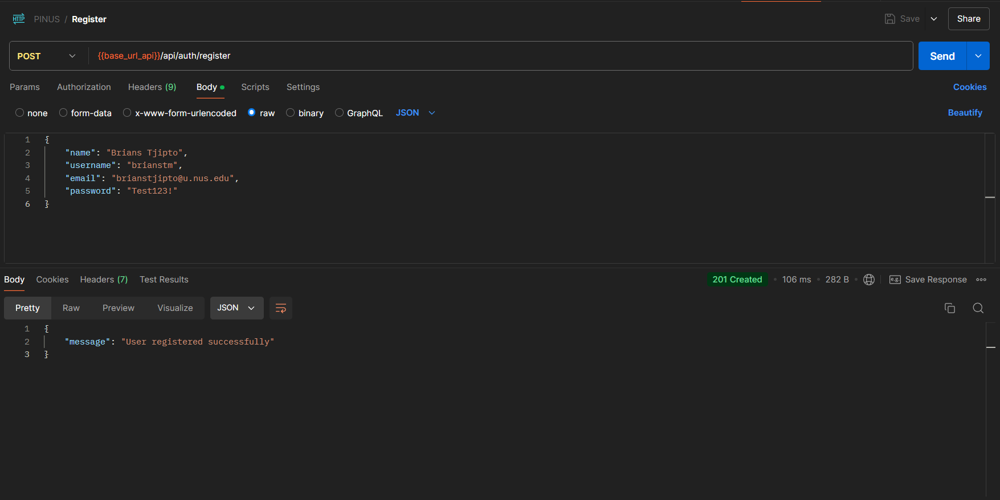

- **POST** `/api/auth/login`

  - Logs in a user and returns a JWT token.
  - **Body**: `{ "emailOrUsername": "brianstjipto@u.nus.edu", "password": "Test123!" }`

  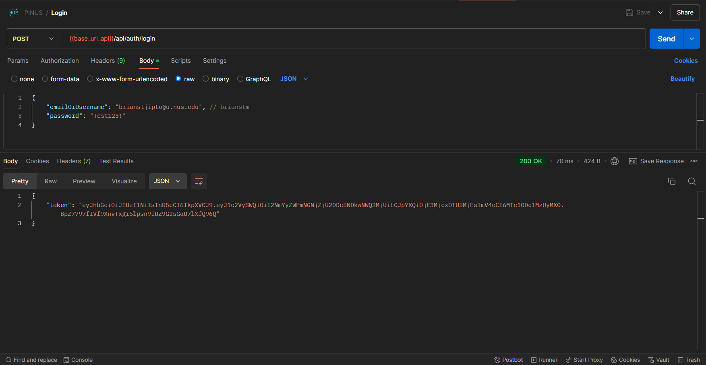

> JWT (JSON Web Token) is a compact, URL-safe token used for securely transmitting information between parties as a JSON object, typically for authentication and authorization purposes.

### Expense Management

#### JWT Token

Add the Token in the Authorization, select the Bearer Token, and add the token from the login

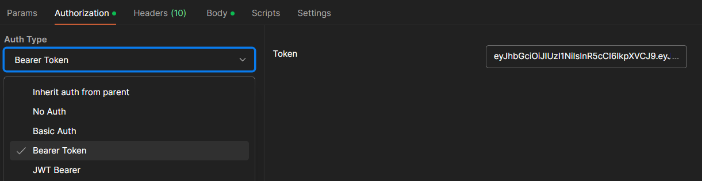

- **POST** `/api/expenses`

  - Creates a new expense.
  - **Requires**: JWT Token.
  - **Body**: `{ "title": "Groceries", "description (optional)": "monthly groceries", "amount": 100, "date": "2024-09-25T15:30:00", "category": "Food", "image (optional)": <file> }`

  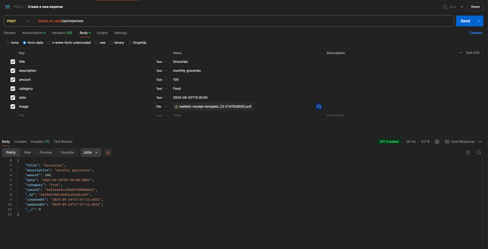

- **GET** `/api/expenses`

  - Fetches all expenses for the authenticated user.
  - **Requires**: JWT Token.

  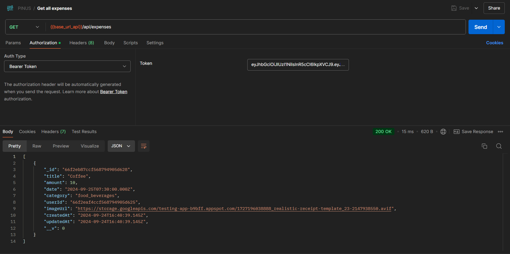

- **GET** `/api/expenses/:id`

  - Fetches a specific expense by its ID.
  - **Requires**: JWT Token.

  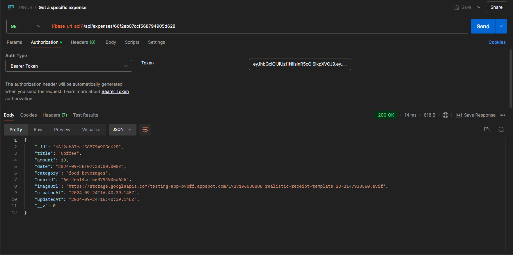

- **PUT** `/api/expenses/:id`

  - Updates an existing expense.
  - **Requires**: JWT Token.
  - **Body**: Partial or full fields of the expense to update.

  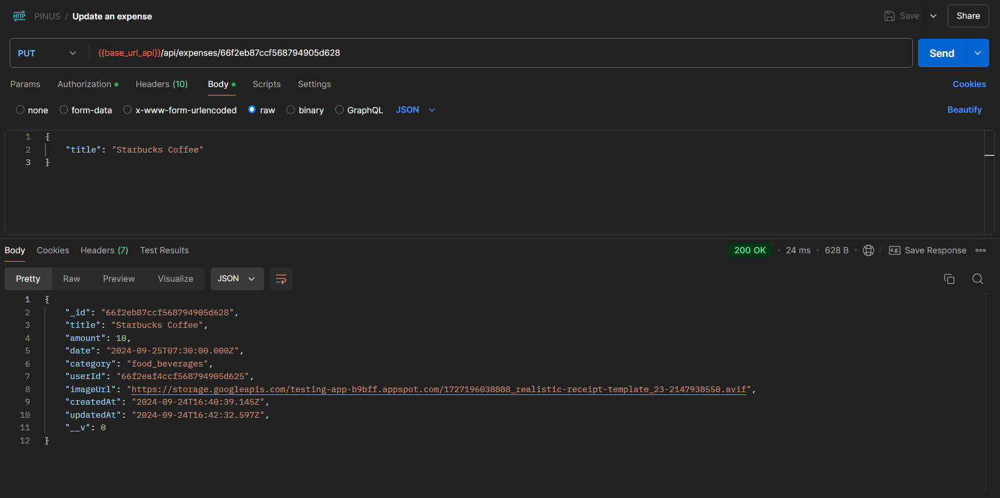

- **DELETE** `/api/expenses/:id`

  - Deletes an expense by its ID.
  - **Requires**: JWT Token.

  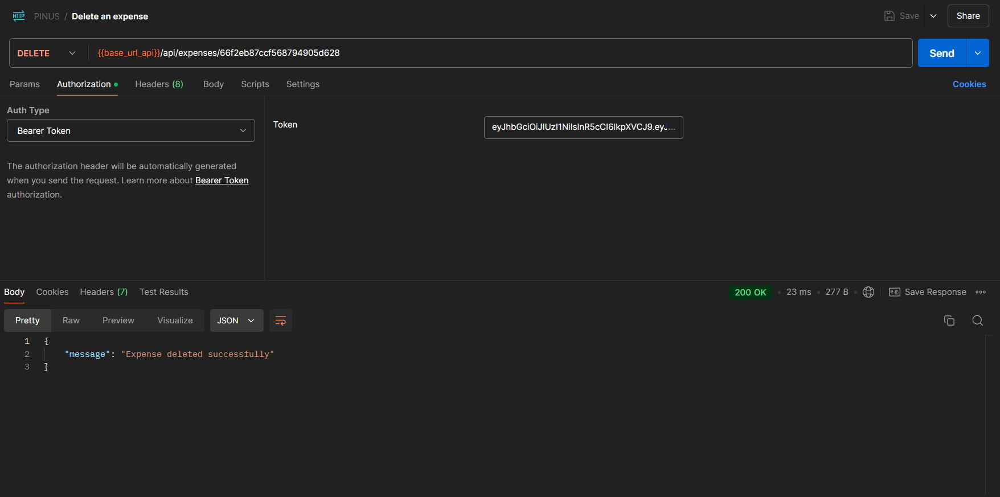

---

## Running the Application

1. Clone the repository.

   ```bash
   git clone https://github.com/your-username/expense-tracker-api.git
   cd expense-tracker-api
   ```

2. Install the required dependencies:

   ```bash
   npm install
   ```

3. Create a `.env` file in the root directory and configure the necessary environment variables as listed above.

   - On Windows:

     ```cmd
     copy .env.example .env
     ```

   - On Linux/macOS/WSL:

     ```bash
     cp .env.example .env
     ```

4. Start the development server:

   ```bash
   npm run dev
   ```

5. The server should now be running on `http://localhost:8000`. Use tools like Postman or curl to test the endpoints.

---

## Environment Variables

The application requires the following environment variables to function correctly:

```env
MONGODB_URI=mongodb+srv://...
JWT_SECRET=your_jwt_secret
FIREBASE_SERVICE_ACCOUNT_KEY={"type": "service_account", ... }
FIREBASE_STORAGE_BUCKET=....appspot.com
PORT=8000
```

### MONGODB_URI

To configure the MongoDB connection:

1. Visit [MongoDB](https://www.mongodb.com/cloud/atlas/register) and create an account.

   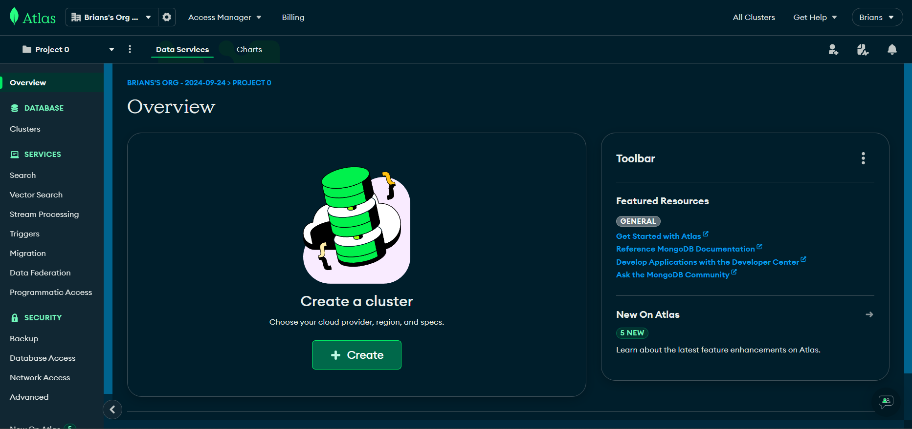

2. Set up a new cluster.

   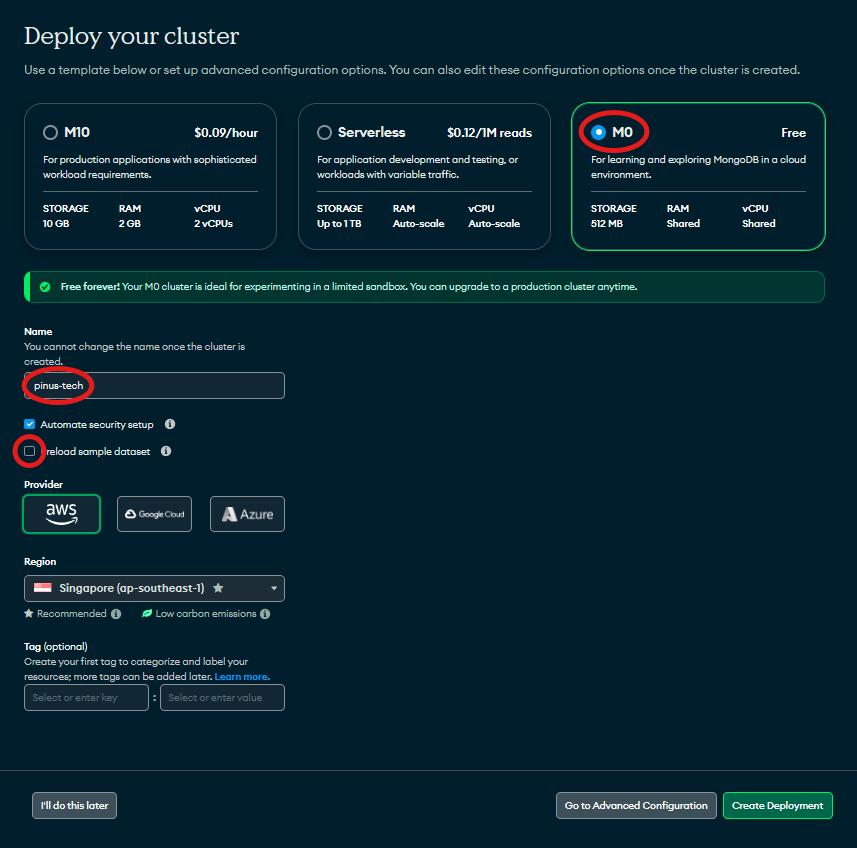

3. Create a database user and password. **Save the credentials** for future use.

   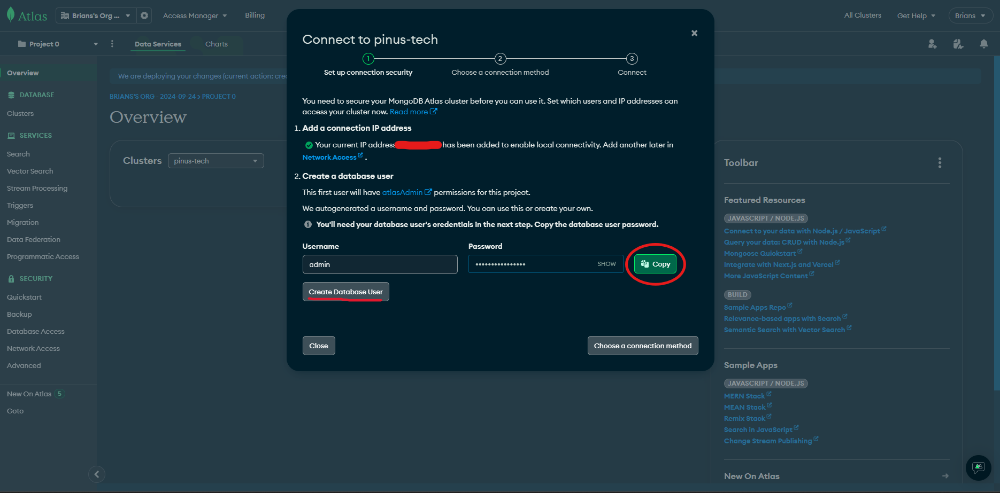

4. Click `Connect` on the cluster dashboard to retrieve the connection string.

   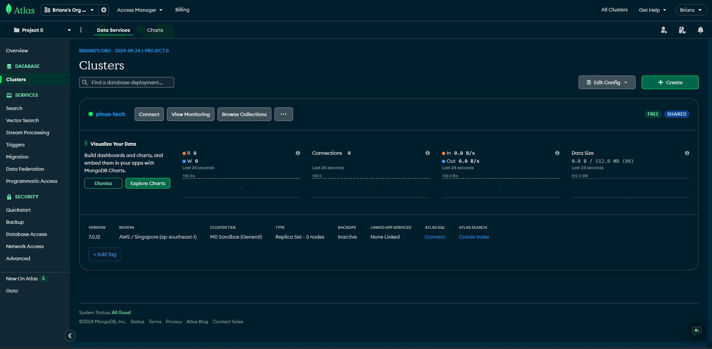

5. Copy the connection string and replace `admin` with your MongoDB username, and `<db_password>` with your password. Add this to your `.env` file under `MONGODB_URI`.

   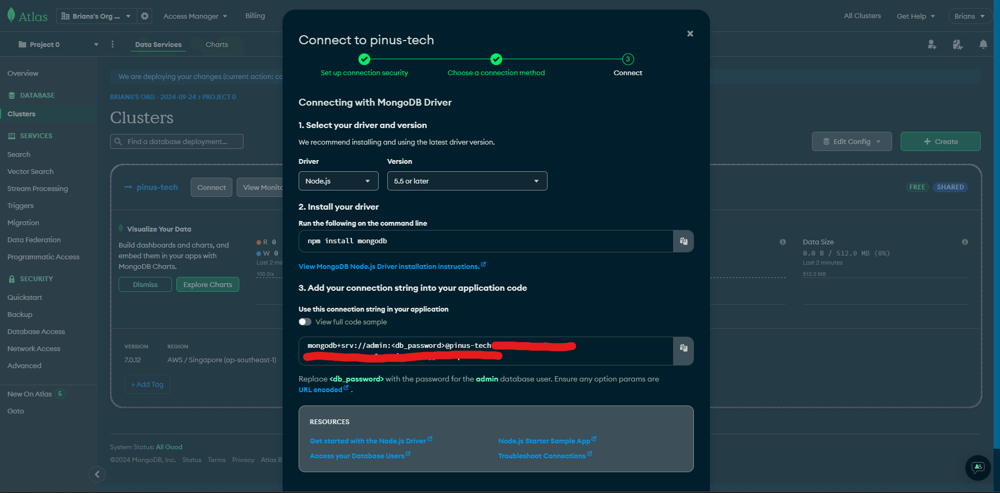

### FIREBASE_SERVICE_ACCOUNT_KEY & FIREBASE_STORAGE_BUCKET

To configure Firebase:

1. Open the [Firebase Console](https://console.firebase.google.com) and log in with your Google account.

   

2. Create a Cloud Storage bucket in Firebase.

   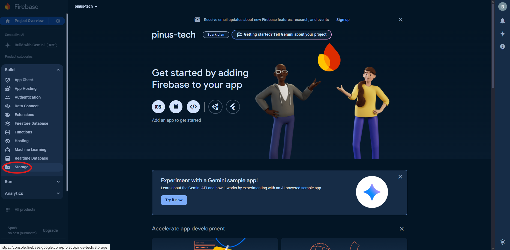

3. Choose a `Cloud Storage Location` (`asia-southeast1` which is Singapore), and either Production or Test mode works.

   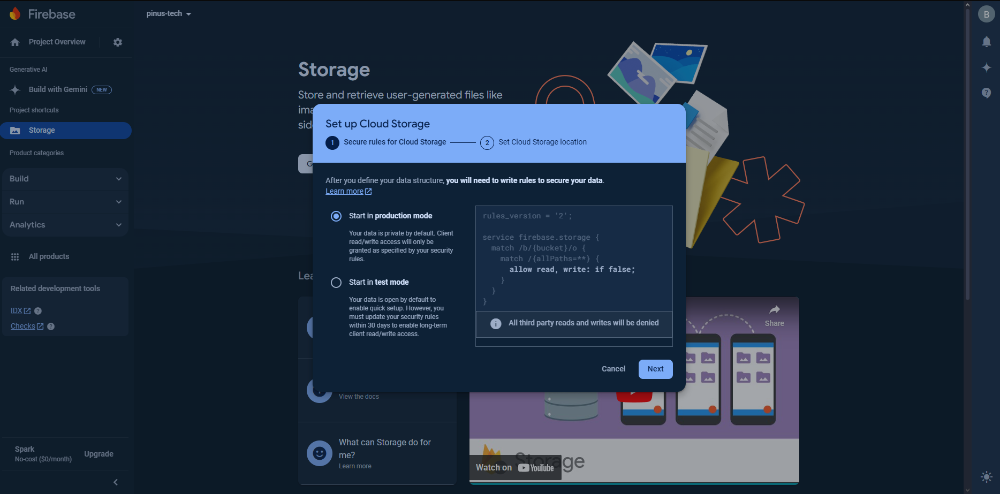

4. In the `Project Settings` under `Service Accounts`, click `Generate New Private Key`. Download the JSON file and copy its contents to the `.env` file under `FIREBASE_SERVICE_ACCOUNT_KEY`.

   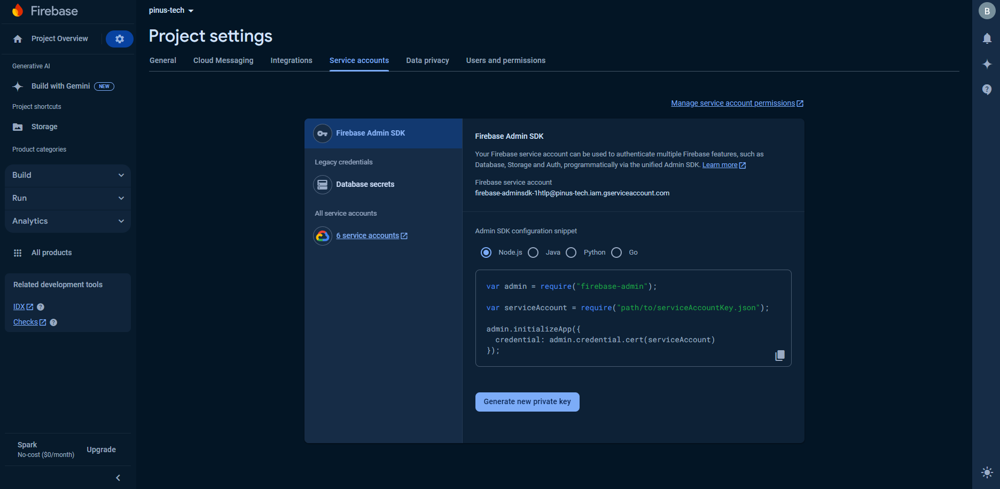

5. Go back to the Firebase Storage settings and copy the bucket URL. Add this to your `.env` file under `FIREBASE_STORAGE_BUCKET`.

   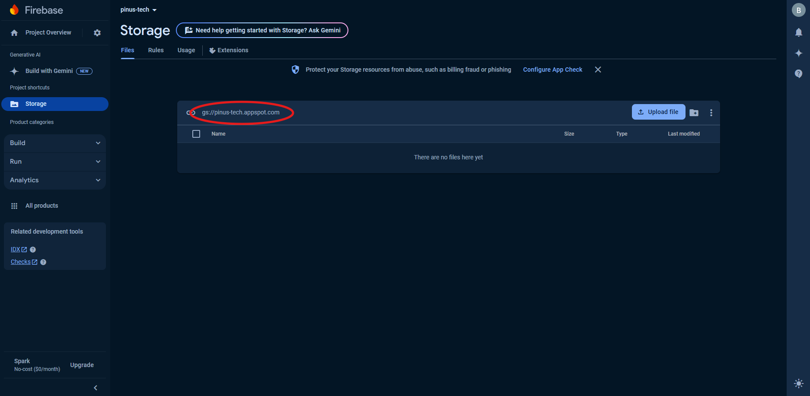

### JWT_SECRET

This key is used to sign and verify JSON Web Tokens (JWT). Choose a strong, secure secret value for `JWT_SECRET`, as it's critical for API authentication and security.

### PORT

The port on which the API will run. Default is `8000`.
